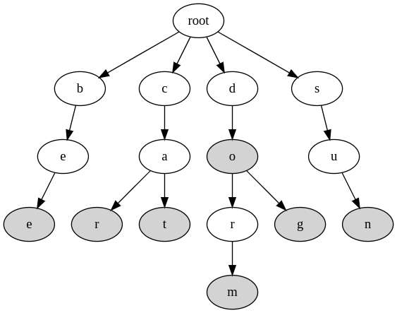

# CISC-5006 Data Structures

## Final Exam -  Due 05/09/2023 8 PM EST

### Introduction
---
There are two general sections to this final for a total of __30 points__:

1. A written section worth __10 points__ total.
2. A coding section worth __20 points__ total.

### Programming Environment Setup

The coding section of the final requires some setting up.

1. Create a folder on your computer to store your assignment and initialize a git repo in it.
2. Copy all of the files in [final](/final/) into that directory. After copying, your folder should contain:
    - include/open_addressed_hash_table.h
    - include/trie.h
    - test/catch_amalgamated.cpp
    - test/catch_amalgamated.hpp
    - test/CMakeLists.txt
    - test/open_hash_table_tests.cpp
    - test/trie_tests.cpp
    - CMakeLists.txt
    - README.md

3. Create a `build` directory to store our build artifacts.
4. Create a `.gitignore` file to ignore `build/`.
5. Generate the build: `cmake -S . -B build`
6. Execute the build: `cmake --build build`
    - This may take a while the first time you run this as the testing library has to be built.
    - You'll also notice that there are some warnings printed out. They're due to the functions being stubbed.
7. At this point, you'll have the following executables:
    - `build/test/open_hash_table_tests` -- these are the tests for `OpenHashTable`
    - `build/test/trie_tests` -- these are the tests for the `Trie`
8. At this point, you're done with setup. I recommend making your first commit here.

The test framework we are using is called [Catch2](https://github.com/catchorg/Catch2). It's a relatively lightweight and fast testing framework that's quick to adopt to new projects. In our build, we use some common conventions of CMake projects:

1. We have a separate CMakeLists file for building the tests.
2. We have an `include` folder that stores our common header files.
3. We keep the `Catch2` files in `test` because they're only used by test files and we don't want them polluting other build targets.

### Programming Assignment 1: open addressed hash table
---
1. __(10 points)__ The first part of your assignment will be to fill in the stub class in `include/open_addressed_hash_table.h` and get all of the tests in `test/open_hash_table_tests.cpp` to pass. These tests _must_ pass in order to get full marks. Additionally, there are some requirements that __must__ be fulfilled by your implementation:
    - you __MUST__ use open addressing with linear probing to resolve hash collisions
        - using another hash collision resolution method will cause you to receive __0 points__ on this assignment
    - your table is expected to start with an initial capacity of __5__
    - your table is expected to resize by doubling its table size after running out of room
    - your table uses integer keys only and any integer can be used as a key
    - if you decide to manually manage memory via `new`/`new[]`, you must `delete`/`delete[]` it when necessary (and use the right form of `delete`)
        - failure to properly manage memory will lead to losing points
    - some functions are annotated with `CONDITION` comments. This indicates that your code needs to meet the specified condition or you get docked a point _even if your code passes the tests_

Consider the below when implementing your code:
- each failing test docks you a point.
- each remaining warning also docks you a point.
- follow the class [cpp style guide](/cpp-style-guide.md) when implementing your code and remain consistent with formatting
- adhere to good class design practices when you can
- feel free to add additional tests of your own!
    - the included tests are definitely not exhaustive

### Programming Assignment 2: Prefix Tree
The first part of your assignment will be to fill in the stub class in `include/trie.h` and get all of the tests in `test/trie_tests.cpp` to pass. These tests _must_ pass in order to get full marks. 

A [trie](https://en.wikipedia.org/wiki/Trie) -- or prefix tree -- is a search tree data structure to store a set of strings such that we can efficiently look up strings via their prefixes. For this assignment, __we only consider strings with lowercase English letters__. A prefix tree has the following properties:
1. Each prefix tree has a root indicating the start of each string.
2. Each path from the root node in the tree corresponds to a prefix of some string in the set.
3. Each node has a flag to denote if the prefix is actually also a string in the set.
4. A string is a prefix of itself.
5. Each node may have at most 26 child nodes, for the 26 letters.

Given a set that contains 7 English strings: `{ “bee”, “cat”, “car”, “do”, “dog”, “dorm”, and “sun” }`. The corresponding prefix tree should conceptually be:

where the shaded nodes indicate the end of a string. 

When searching for a string `s` (e.g., `“cat”`), we traverse the tree level by level and return true if there is a path to `s`. When adding a string `s`, we do the search and mark the node as the end (and create new nodes if necessary). For example, adding string `“be”` will add node `e` under `b` and mark `e` as the end of a word. Adding string `“sue”` will create a marked child node `e` for node `u`.

Consider the below when implementing your code:
- you are free to use any container you wish
- each failing test docks you a point
- each remaining warning also docks you a point
- follow the class [cpp style guide](/cpp-style-guide.md) when implementing your code and remain consistent with formatting
- adhere to good class design practices when you can
- feel free to add additional tests of your own!
    - the included tests are definitely not exhaustive
- some functions are annotated with `CONDITION` comments. This indicates that your code needs to meet the specified condition or you get docked a point _even if your code passes the tests_.
- if you decide to manually manage memory via `new`/`new[]`, you must `delete`/`delete[]` it when necessary (and use the right form of `delete`)
    - failure to properly manage memory will lead to losing points

---

### Written Section (10 points)
---

The second part of your assignment consists of answering the following questions as best you can. When answering the written questions, please be as specific as possible. Please create a seperate text file containing your answers.
    
1. __(3 points)__ In your implementation of `OpenHashTable`, how did you handle representing an empty bucket in the table? Discuss the pros and cons of the strategy you chose and other possible strategies you could have used.

2. __(3 points)__ Imagine you're a software engineer at a medical insurance company's records team. Your manager asks you to implement a feature that will display the top `N` most expensive claims the company processed last year where `N` is provided by the user. You work at a very popular insurance company so you have millions of claims you need to search through. For security reasons, you only have access to two pieces of information for each claim: the claim id and the claim price. Your manager adds a constraint: your feature must be __fast__. They don't care how much memory or resources are used as long as the answer is obtained as fast as possible. Also, `N` can get arbitrarily big. What data structure would you consider using for this task? Explain your reasoning. 

3. __(2 points)__ If your manager had said that he instead only cares about the __most__ expensive claim (not the `N` most expensive), would this change your answer? Either way, explain your reasoning.

4. __(2 points)__ After implementing the feature above, you discover that your program is using way too much memory when `N` is large. In fact, this has prompted your manager to relax one of his expectations. `N` is now always _less than_ 10. How would you use this new information to improve your program?

### Submitting your work

Zip the entire directory (minus `build/` of course) and email/Slack it to me prior to the deadline. The zip should include:
- include/open_addressed_hash_table.h
- include/trie.h
- test/catch_amalgamated.cpp
- test/catch_amalgamated.hpp
- test/CMakeLists.txt
- test/open_hash_table_tests.cpp
- test/trie_tests.cpp
- CMakeLists.txt
- README.md
- .git/
- .gitignore
- a text file with your answers to the written section
